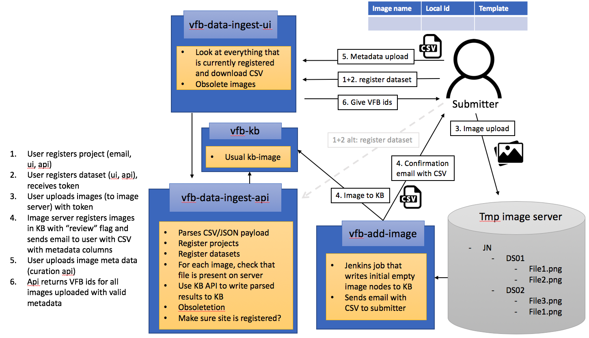

# Virtual Fly Brain ID Serve: Overview
=============

Summary: The VFB ID server allows the user to register image data and reserve VFB identifiers. It consists of four main components:

1. vfb-imageserver: The [image server](https://www.synology.com/en-global/knowledgebase/DSM/help/FileStation/file_request) allows the user to bulk-upload a set of images to a specified user directory. Files uploaded this way cannot be changed.
1. vfb-kb
   * Image: virtualflybrain/docker-neo4j-knowledgebase:neo2owl
   * Git: https://github.com/VirtualFlyBrain/docker-neo4j-knowledgebase
   * Summary: The VFB KB instance loads the [VFB KB Archive](http://data.virtualflybrain.org/archive/VFB-KB.tar.gz) and deploys it as a Neo4J instance. All the image metadata and their associations with Neurons and projects will be managed in the KB.
   * Access: http://kb.ids.virtualflybrain.org/browser/
1. vfb-curation-api
  * Image: matentzn/vfb-curation-api:latest
  * Git: https://github.com/VirtualFlyBrain/vfb-curation-api
  * Summary: The ID Server API is a swagger REST API that allows the registration of datasets and images (image metadata upload).
  * Access: http://api.ids.virtualflybrain.org/api/
1. vfb-curation-ui
  * Image: matentzn/vfb-curation-ui-demo:latest
  * Git: https://github.com/monarch-ebi-dev/vfb-curation-demo
  * Summary: The ID Server UI offers access to basic functionality of the vfb-curation-api. It furthermore allows groups to look at 'what is already there' in terms of metadata (without the possibility to change data).
  * Access: http://api.ids.virtualflybrain.org/api/
